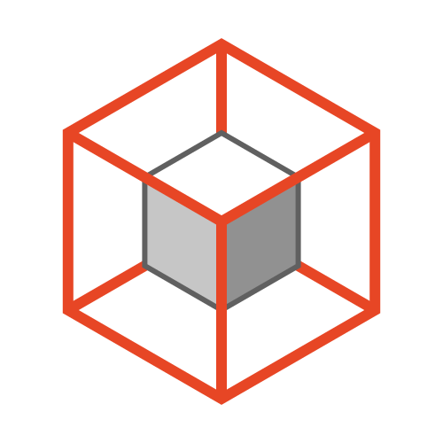
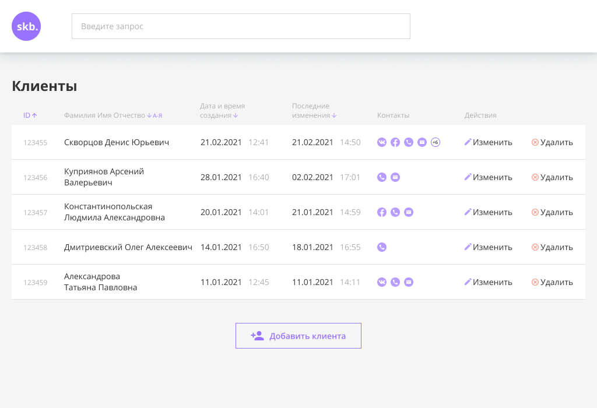
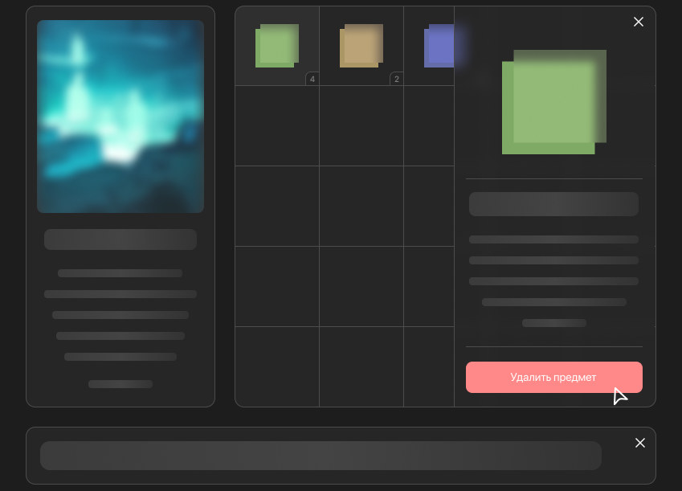
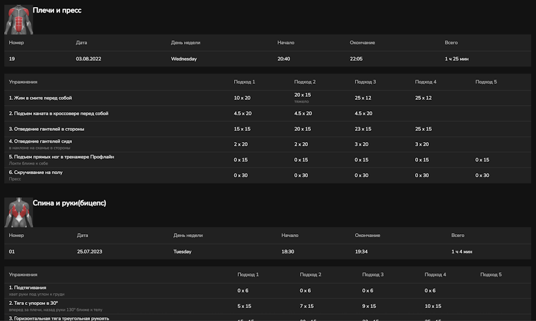

## Привет, меня зовут Сергей!

##### О себе:

Привет, я Сергей — опытный full-stack DevOps-разработчик.

В IT начал со школы, продолжил в академии. Прошёл углублённое обучение по Vue.js и React, изучаю и применяю современные архитектурные подходы.

⚙️ Комбинирую frontend и backend, проектирую масштабируемые приложения, опираясь на:

`Feature-Sliced Design (FSD)` `Принципы SOLID и ООП` `Чистый код и модульность`

⚡ Анализирую архитектуры, подбираю оптимальные решения под задачи бизнеса.

##### Цели и задачи:

- ⚡️ Легко обучаем, любая технология до 2-х недель.
- 🔎 Использую лучшие практики и придерживаюсь принципов Чистого кода.
- ✉️ Связаться со мной:  

#### Фреймворки, Технологии, Инструменты, Языки
<table>
  <tr>
    <th width='280px'>Фреймворки</th>
    <th  width='280px'>Технологии</th>
  </tr>
  <tr>
    <td>
      

        
      

    </td>
    <td>
      

        
      

    </td>
  </tr>
  <tr>
    <th  width='280px'>Инструменты</th>
    <th  width='280px'>Языки</th>
  </tr>
  <tr>
    <td>
      

        
      

    </td>
    <td>
      

         
      

    </td>
  </tr>
</table>

  
<strong>🧩 Мои проекты</strong>

  <table>
    <tr>
            <td width='320px'>
                
            </td> 
            <td>
                <h3><a href='https://gitlab.com/sergey.isanin/crm_final_vue' title='Открыть репозиторий'>CRM</a></h3>
                

                
Vue 3

            </td>
        </tr><tr>
            <td width='320px'>
                
            </td> 
            <td>
                <h3><a href='https://github.com/i5anin/drag-and-drop-inventory' title='Открыть репозиторий'>Инвентарь</a></h3>
                
Инвентарь — Vue 3 SPA
Одностраничное приложение-инвентарь, реализованное на Vue 3 (Composition API).

Особенности:

• Drag & Drop перемещение предметов;
• Сохранение данных в localStorage (автономная работа без сервера);
• Плашка с описанием и удалением при клике на предмет;
• Полностью кастомный UI на SCSS, без UI-фреймворков;
• Структурированная архитектура: модульная разбивка, вынос логики, переиспользуемые компоненты.

                
Vue 3

            </td>
        </tr><tr>
            <td width='320px'>
                
            </td> 
            <td>
                <h3><a href='https://github.com/i5anin/Order-Book-Vue3' title='Открыть репозиторий'>Биржевой стакан</a></h3>
                

                
Vue 3 UI Element Plus

            </td>
        </tr><tr>
            <td width='320px'>
                
            </td> 
            <td>
                <h3><a href='https://gitlab.com/sergey.isanin/exam_vue' title='Открыть репозиторий'>Магазин нижнего белья Moire</a></h3>
                

Полноценная версия
Финальный проект Skillbox

                
Vue 3

            </td>
        </tr><tr>
            <td width='320px'>
                
            </td> 
            <td>
                <h3><a href='https://gitlab.com/sergey.isanin/final_javascript_pro' title='Открыть репозиторий'>Coin банк BTC</a></h3>
                
JavaScript
Перевод средств между счетами

                
JavaScript

            </td>
        </tr><tr>
            <td width='320px'>
                
            </td> 
            <td>
                <h3><a href='https://github.com/i5anin/first_todo-list' title='Открыть репозиторий'>ToDoList</a></h3>
                
Первый проект

                
Vue 3, Firebase

            </td>
        </tr><tr>
            <td width='320px'>
                
            </td> 
            <td>
                <h3><a href='https://github.com/i5anin/vue-gym-training' title='Открыть репозиторий'>gym-training</a></h3>
                
my gym

                
Vue 3 Vuetify

            </td>
        </tr>
  </table>

