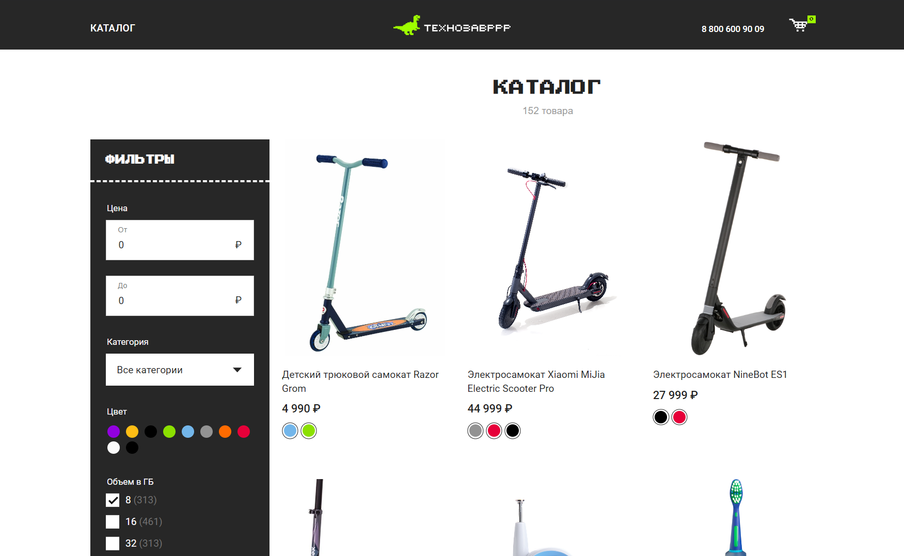
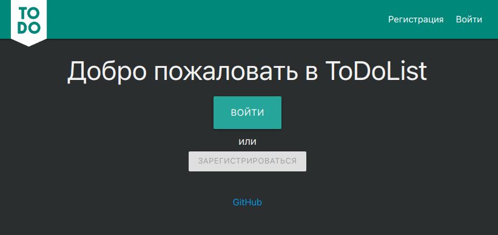

## Привет, меня зовут Сергей!

---

### :man_technologist: Обо мне:

Я веб разработчик.

Мой путь в it начался ещё со школы и института, немного поработал в it сфере, укрепил свои знания курсами по Vue.js Skillbox, где я проходил 7-месяцев курсы.

Работал с такими языками как: C++ Cи C# Python 1C.

Сейчас для меня основными являются языки указанные ниже.

- :telescope: Изучаю веб-разработку ищу современные решения!

- :seedling: Обязательно сделаю собственный курс.

- :zap: Хочу освоить новую профессию и найти работу.

- :mailbox: Как связаться со мной:
  
  

---

### 🤝 Социальные сети:

  

      
    
    
      
     

  

---

### 💻 Технологии:

<!-- vue -->
&nbsp
<!-- Nuxt.js -->
&nbsp
<!-- JavaScript -->
&nbsp
<!-- Git -->
&nbsp
<!-- HTML 5 -->
&nbsp
<!-- CSS -->
&nbsp
<!-- Firebase -->
&nbsp
<!-- github -->
&nbsp
<!-- gitlab -->
&nbsp
<!-- sass -->
&nbsp

---

### 🛠 Инструменты:

<!-- DaVinci Resolve -->
&nbsp
<!-- Photoshop -->
&nbsp
<!-- Figma -->
&nbsp

---

### 💻 Пройденные курсы:

| Сайт             |                               Курс                               |       Дата        |
| ---------------- | :--------------------------------------------------------------: | :---------------: |
| skillbox.ru      | Программа профессиональной переподготовки «Frontend-разработчик» | 08.2022 - 03.2023 |
| netology.ru      |                     Старт в программировании                     | 07/2022 - 08/2022 |
| stepik.org       |              Основы программирования на C. Задачи.               | 07/2022 - 08/2022 |
| netology.ru      |                       Основы верстки сайта                       | 07/2022 - 08/2022 |
| netology.ru      |       Первые шаги в JavaScript: создаём сайт и приложение        | 07/2022 - 08/2022 |
| stepik.org       |            Веб-разработка для начинающих: HTML и CSS             | 07/2022 - 08/2022 |
| stepik.org       |                    JavaScript для начинающих                     | 07/2023 - 07/2022 |
| stepik.org       |                Web-технологии: начальный уровень                 | 07/2023 - 07/2022 |
| practicum.yandex |                     Факультет Веб разработки                     | 07/2022 - 07/2022 |

---

### 💻 Публичное портфолио

<table>
    <!-- -- Магазин Moire -- -->
    <tr>
         <td width='320px'>
                    
                </td> 
        <td>
            <h3>
                <a href='https://gitlab.com/sergey.isanin/exam_vue' title='Открыть репозиторий'>
                    Магазин нижнего белья Moire
                </a>
            </h3>
            
Vue 3

            
Финальный проект Skillbox

        </td>
    </tr>
        <!-- -- Coin банк -- -->
    <tr>
        <td width='320px'>
            
          </td>
        <td>
            <h3><a href='https://gitlab.com/sergey.isanin/final_javascript_pro' title='Открыть репозиторий'>
                    Coin банк BTC
                </a>
            </h3>
            
JavaScript

        </td>
    </tr>
    <!-- -- CRM -- -->
    <tr>
        <td width='320px'>
            
          </td> 
        <td>
            <h3><a href='https://gitlab.com/sergey.isanin/final_vue' title='Открыть репозиторий'>CRM</a></h3>
            
Vue 3

        </td>
    </tr>
    <!-- -- Technozavrrr -- -->
    <tr>
         <td width='320px'>
            
          </td> 
        <td>
            <h3><a href='https://gitlab.com/sergey.isanin/vue/-/tree/main/08_api_2' title='Открыть репозиторий'>Магазин
                    электроники Technozavrrr</a>
            </h3>
            
Vue 2

            
Раннья версия Moire

        </td>
    </tr>
    <!-- -- SitDownPls -- -->
    <tr>
        <td width='320px'>
            
          </td> 
        <td>
            <h3><a href='https://gitlab.com/sergey.isanin/final_weblayout_pro'
                    title='Открыть репозиторий'>SitDownPls</a></h3>
            
Многостраничный лендинг

        </td>
    </tr>
    <!-- -- Evklid -- -->
    <tr>
        <td width='320px'>
            
          </td> 
        <td>
            <h3><a href='https://gitlab.com/sergey.isanin/weblayout_pro/-/tree/main/04_optimization'
                    title='Открыть репозиторий'>Evklid</a></h3>
            
Одностраничный лендинг

        </td>
    </tr>
    <!-- -- Lagoona -- -->
    <tr>
        <td width='320px'>
            
          </td> 
        <td>
            <h3>
                <a href='https://gitlab.com/sergey.isanin/weblayout/-/tree/main/10_advanced-css'
                    title='Открыть репозиторий'>Lagoona</a>
            </h3>
            
Одностраничный лендинг

        </td>
    </tr>
    <!-- -- ToDoList -- -->
    <tr>
        <td width='320px'>
            
          </td> 
        <td>
            <h3><a href='#' title='Открыть репозиторий'>ToDoList</a></h3>
            
Vue 3 Первый проект

        </td>
    </tr>
</table>
