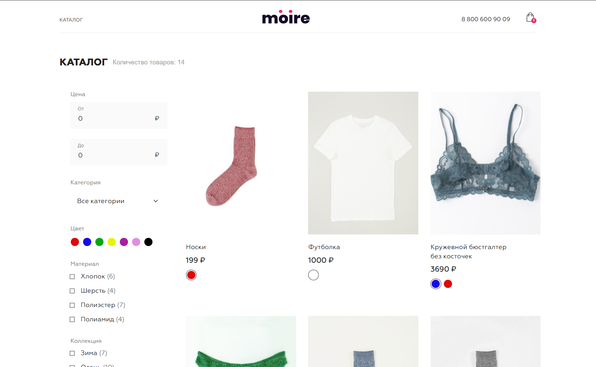
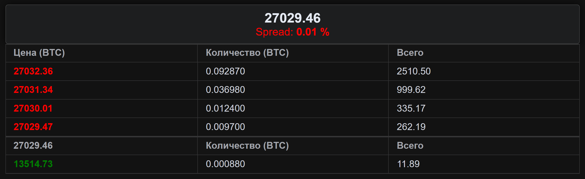
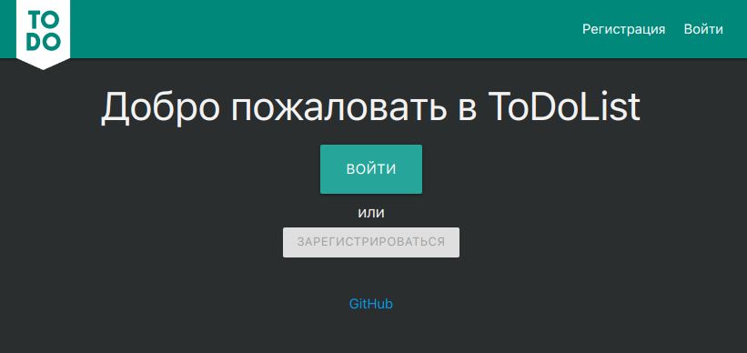

## Привет, меня зовут Сергей!

##### О себе:

Я веб разработчик. Мой путь в IT начался ещё со школы и академии. Работал в IT сфере и укрепил свои знания курсами по Vue.js от Skillbox, где проходил 7-месячные курсы.

##### Цели и задачи:

- ⚡️ Ищу интересную работу.
- 🔎 Изучаю веб-разработку и ищу современные решения!
- ✉️ Связаться со мной:  

#### Фреймворки

#### Технологии

#### Инструменты

#### Мои проекты
<table>
<tr>
            <td width='320px'>
                
            </td> 
            <td>
                <h3><a href='https://gitlab.com/sergey.isanin/exam_vue' title='Открыть репозиторий'>Магазин нижнего белья Moire</a></h3>
                

Полноценная версия
Финальный проект Skillbox

                
Vue 3

            </td>
        </tr><tr>
            <td width='320px'>
                
            </td> 
            <td>
                <h3><a href='https://gitlab.com/sergey.isanin/final_javascript_pro' title='Открыть репозиторий'>Coin банк BTC</a></h3>
                
JavaScript
Перевод средств между счетами

                
JavaScript

            </td>
        </tr><tr>
            <td width='320px'>
                
            </td> 
            <td>
                <h3><a href='https://gitlab.com/sergey.isanin/final_vue' title='Открыть репозиторий'>CRM</a></h3>
                
backend проснётся в течение 1 мин

                
Vue 3

            </td>
        </tr><tr>
            <td width='320px'>
                
            </td> 
            <td>
                <h3><a href='https://github.com/i5anin/Order-Book-Vue3' title='Открыть репозиторий'>Биржевой стакан</a></h3>
                

                
Vue 3

            </td>
        </tr><tr>
            <td width='320px'>
                
            </td> 
            <td>
                <h3><a href='https://gitlab.com/sergey.isanin/vue/-/tree/main/08_api_2' title='Открыть репозиторий'>Магазин электроники Technozavrrr</a></h3>
                
Простая версия магазина

                
Vue 2

            </td>
        </tr><tr>
            <td width='320px'>
                
            </td> 
            <td>
                <h3><a href='https://gitlab.com/sergey.isanin/final_weblayout_pro' title='Открыть репозиторий'>SitDownPls</a></h3>
                
Многостраничный лендинг

                
HTML, CSS, JavaScript,

            </td>
        </tr><tr>
            <td width='320px'>
                
            </td> 
            <td>
                <h3><a href='https://gitlab.com/sergey.isanin/weblayout_pro/-/tree/main/04_optimization' title='Открыть репозиторий'>Evklid</a></h3>
                
Одностраничный лендинг

                
HTML, CSS, JavaScript,

            </td>
        </tr><tr>
            <td width='320px'>
                
            </td> 
            <td>
                <h3><a href='https://gitlab.com/sergey.isanin/weblayout/-/tree/main/10_advanced-css' title='Открыть репозиторий'>Lagoona</a></h3>
                
Одностраничный лендинг

                
HTML, CSS, JavaScript,

            </td>
        </tr><tr>
            <td width='320px'>
                
            </td> 
            <td>
                <h3><a href='https://github.com/i5anin/first_todo-list' title='Открыть репозиторий'>ToDoList</a></h3>
                
Первый проект

                
Vue 3, Firebase

            </td>
        </tr>
</table>

#### Пройденные курсы

<table>

<tr>
<th>Сайт</th>
<th>Курс</th>
<th>Дата</th>
</tr>
<tr>
<td>skillbox.ru</td>
<td>Программа профессиональной переподготовки «Frontend-разработчик»</td>
<td>08.2022 - 03.2023</td>
</tr><tr>
<td>stepik.org</td>
<td>Web-технологии: начальный уровень</td>
<td>07/2022 - 08/2022</td>
</tr><tr>
<td>stepik.org</td>
<td>Веб-разработка для начинающих: HTML и CSS</td>
<td>07/2022 - 08/2022</td>
</tr><tr>
<td>stepik.org</td>
<td>JavaScript для начинающих</td>
<td>07/2022 - 08/2022</td>
</tr><tr>
<td>practicum.yandex</td>
<td>Факультет Веб разработки</td>
<td>07/2022 - 08/2022</td>
</tr>
</table>

#### Статистика

    
    

###### код для `markdown` сгенерирован на JavaScript `node main.js`
