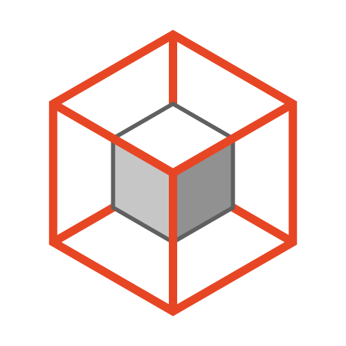
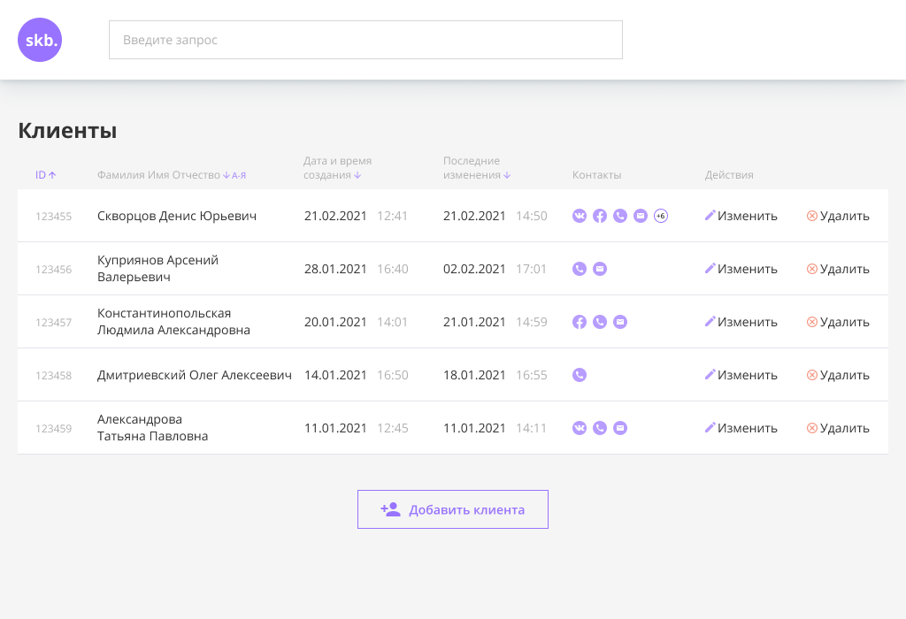
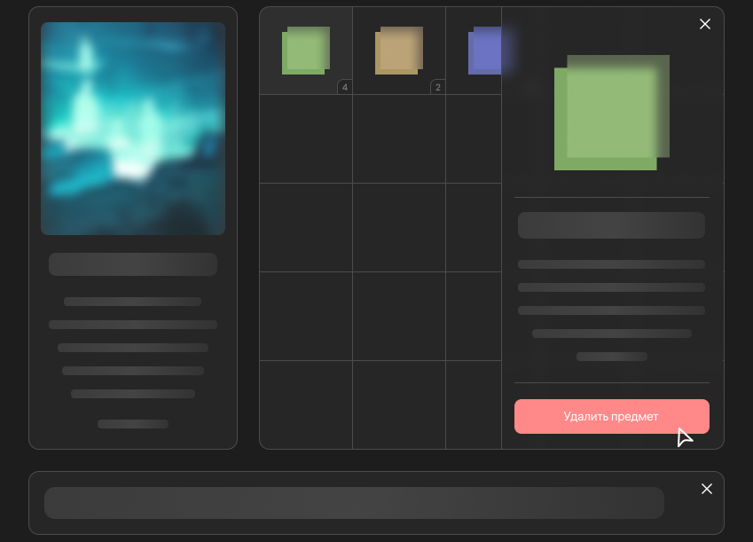
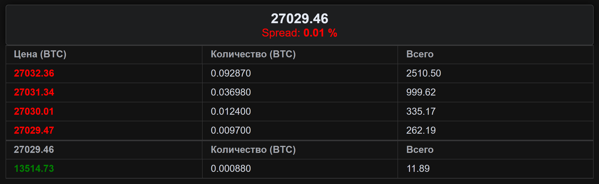
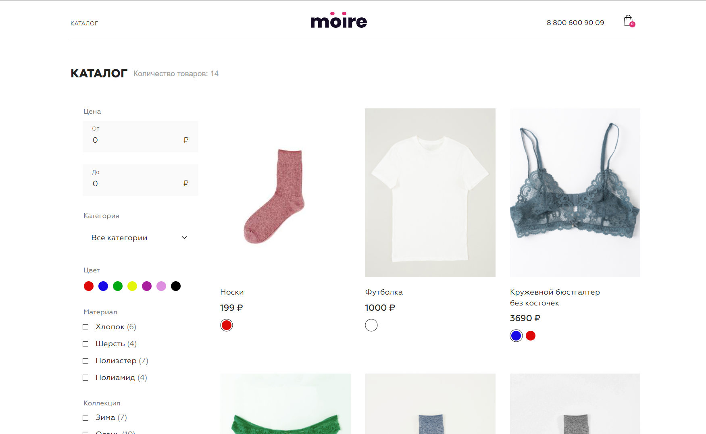

## Hi, I'm Sergey 👋

Frontend/full-stack developer — Vue 3 / Nuxt 3 SPAs, architecturally
complex UI platforms, Node.js / NestJS backends.

I care about maintainable code (SOLID, DRY, KISS, Feature-Sliced Design),
test coverage, and using AI tooling (Claude Code, Cursor, Copilot) to move
faster without cutting corners.

- 🔭 Currently building CRM and internal tools on Vue 3 + NestJS + Supabase
- 🌱 Exploring AI-assisted development workflows
- 📫 Contact:  

<strong>Русский</strong>

## Привет, я Сергей 👋

Frontend/full-stack разработчик — SPA на Vue 3 / Nuxt 3, архитектурно
сложные UI-платформы, backend на Node.js / NestJS.

Слежу за поддерживаемостью кода (SOLID, DRY, KISS, Feature-Sliced Design),
пишу тесты, использую AI-инструменты (Claude Code, Cursor, Copilot) для
ускорения разработки без потери качества.

- 🔭 Сейчас: CRM и внутренние инструменты на Vue 3 + NestJS + Supabase
- 🌱 Изучаю AI-workflow в разработке
- 📫 Связь: Telegram и Gmail — см. выше

#### Stack

  
  
  
  

#### Activity
<picture>
  <source media='(prefers-color-scheme: dark)' srcset='./public/metrics/metrics.dark.svg'>
  <source media='(prefers-color-scheme: light)' srcset='./public/metrics/metrics.svg'>
  
</picture>

Rendered by <a href='https://github.com/lowlighter/metrics'>lowlighter/metrics</a>, refreshed daily by <a href='.github/workflows/metrics.yml'>GitHub Actions</a> — no manual edits.

  
<strong>🧩 Projects</strong>

  <table>
    <tr>
    <td width='320px'>
        
    </td>
    <td>
        <h3><a href='https://github.com/i5anin/rubik' title='Open repository'>Rubik's Cube</a></h3>
        
Interactive Rubik's Cube in the browser.

• Mouse and keyboard face rotation;
• Transition animation;
• Random scramble generation.

        
Vue 3

    </td>
</tr>
<tr>
    <td width='320px'>
        
    </td>
    <td>
        <h3><a href='https://gitlab.com/sergey.isanin/crm_final_vue' title='Open repository'>CRM</a></h3>
        
Customer management system on Vue 3.

• Client and deal tracking;
• Authorization and access control;
• Skillbox capstone project.

        
Vue 3

    </td>
</tr>
<tr>
    <td width='320px'>
        
    </td>
    <td>
        <h3><a href='https://github.com/i5anin/drag-and-drop-inventory' title='Open repository'>Inventory</a></h3>
        
Single-page inventory app on Vue 3 (Composition API).

• Drag & drop item placement;
• localStorage persistence (works offline, no server);
• Item details and removal on click;
• Fully custom UI in SCSS, no UI framework;
• Modular architecture with reusable components.

        
Vue 3

    </td>
</tr>
<tr>
    <td width='320px'>
        
    </td>
    <td>
        <h3><a href='https://github.com/i5anin/Order-Book-Vue3' title='Open repository'>Order Book</a></h3>
        
Real-time BTC/USDT order book.

• WebSocket connection to the exchange;
• Live bid/ask display;
• Auto-refresh without page reload.

        
Vue 3, Element Plus

    </td>
</tr>
<tr>
    <td width='320px'>
        
    </td>
    <td>
        <h3><a href='https://gitlab.com/sergey.isanin/exam_vue' title='Open repository'>Moire lingerie shop</a></h3>
        
Full-featured store front, Skillbox capstone project.

        
Vue 3

    </td>
</tr>
  </table>

